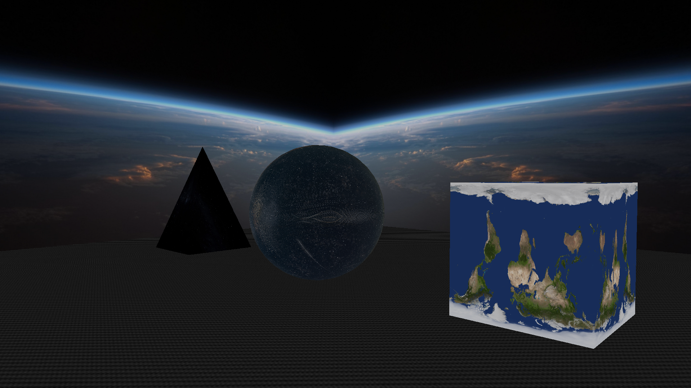

# 3D SCENE & OpenGL + C++
3D scene with three volumetric objects, as well as a moving camera and lighting. Originally written for a Computer Graphics course, it has since been added to.

## SCENE COMPOSITION:
- 4 walls - each with texture;
- Bottom and top borders with texture;
- The floor on which the camera spawns and 3D objects are located;
- 3 3D objects (each of which is a set of triangles with common vertices):
    1. Cube;
    2. Pyramid;
    3. Sphere.
- Сamera that can be controlled;
- Lighting that simulates daylight (without shadows);
- Animation of moving a sphere and rotating it around its axis.

## INSTALATION
You should have the GLFW, GL, glm libraries downloaded in advance. 
This project uses CMake for building. A brief getting started guide for creating a build with CMake follows:
1. Make a new directory for storing the build;
2. cd into the directory;
3. Run `cmake ..`;
4. Run `make`;
5. Run the `./kr`.

Refer to CMakeLists.txt for the build configuration and necessary dependencies.

## INFRASTRUCTURE NOTES:
There are 3 classes in the code:
1. `ShapeRenderer` - is a class that renders triangles depending on input parameters, independently initializes and loads the passed shaders into the shader program (you can choose any other primitive instead of triangles);
2. `Shader` - is a shader program;
3. `Sphere` - Same as ShapeRenderer, but for a sphere.

Textures are located in the folder of the same name